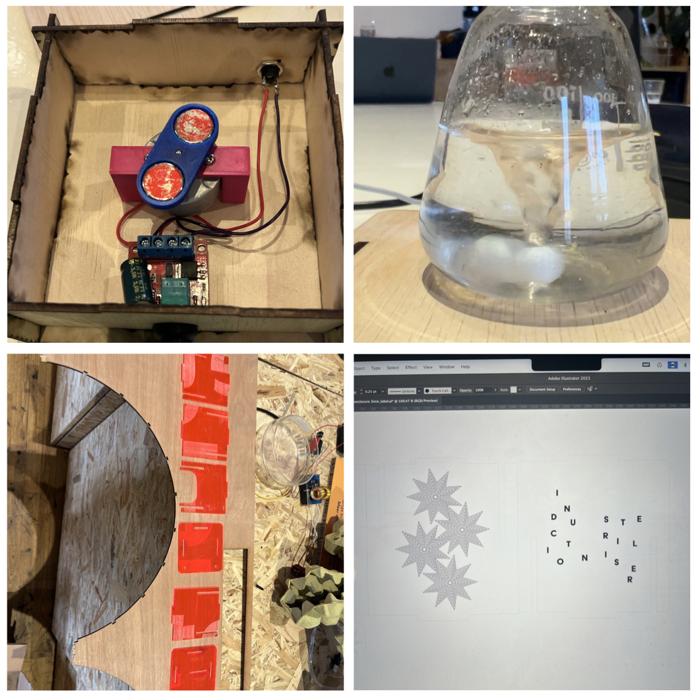

## Open-Source Lab Equipment, Biopolitics + BioReactors 

**Monday** - Got reacquainted with Fusion360 for 3D modelling and Adobe Illustrator for laser cutting and then a quick tour around the FabLab to get familiar with the set up and the equipment. A test print of an eyepiece for a microscope was only half printed but we were still able to understand the basics of 3D printing. I was able to laser cut an old logo iteration onto a piece of wood, but not without the first test catching on fire. Overall, a successful day of reintroduction to familiar programs and seeing how I might be able to apply them to future projects.

**Tuesday** - An exciting day of 3D printing, laser cutting, *AND* soldering! We were given the option to build five different pieces of lab equipment and I decided to go with the magnetic stirrer 1. because it was labelled as easy and 2. it is an incredibly useful sterile way to mix media. The template I used was created by Anne and had a document of instructions and the prepared files to begin which made this entire process much more simple. I began my collecting all the components and lasercutting the pieces of wood to create the housing of the electronics. Next I attached wires to the motor and the jackplug and solder the wires to their respective attachments on the components. An issue with the 3D printer placed a roadbloack in constructing the remaining pieces, however, Anne was able to troubleshoot and a motor mount was printed *in pink!* 

**Wednesday** - Maro's lecture on the Politics of Biotechnology was incredibly fascinating and insightful. While I write this I don't have my notes with me but what **really** stuck with me was she said "Let your work teach you". Almost everytime I work on a project, I get to a point where I fixate on what the final product will look like or how I want the results to unfold, and it pushes me away from the actual process of making/creating/experimenting. Over the last few years I've learned there is so much value in being present during the process and I've noticed that when I am, it lets the work teach me.  *didn't mean to get so reflective but it did trigger this thought so here I am sharing*

**_ANYWAYS_** the rest of the day was allocated towards making a Photobioreactor for red algae species Nodularia Harveyana and Odontella Aurita. Chris and I decided that we wanted to look at Odontella Aurita as we were intrigued by the production of pigment from its biomass and the possibility of creating a textile with it. Initially we wanted to create two environments for the _Odontella Aurita_ to grow in, one that simulates "present" ocean conditions in terms of salinity, acidity and temperature and one that depicts "past" conditions. After discussion it was decided that focusing on one variable would be a simpler exercise but would also help us understand what might be the altering variable. We decided to focus on the air flow by placing an air stone in one bottle and using just the tube in the other.

We created a photobioreactor using two large 1,5L bottles from the grocery store, an airpump, splitter, valve, an air stone and tubing. 
Lecture on Biopolitics given by Maro, which was super fascinating Photobioreactor for red algae species, particularly Odontella aurita

**Thursday** -  Continued working on the 3D printing the magnet holder 

[link to Instagram ](https://www.instagram.com/carolina.minana/)