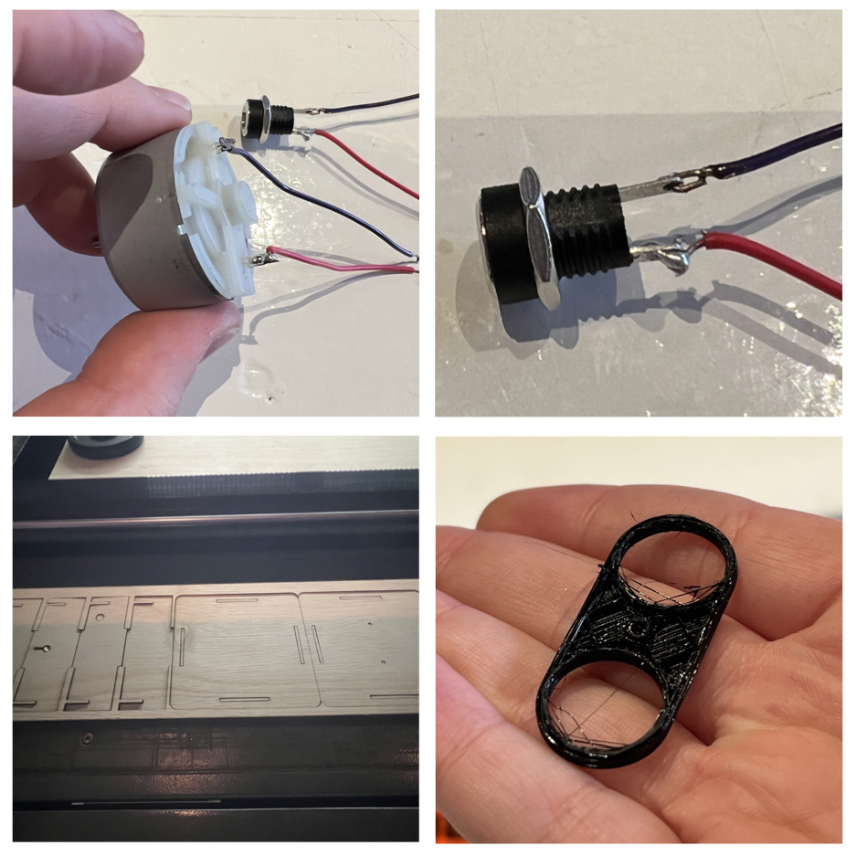

## Open-Source Lab Equipment, Biopolitics + BioReactors 

**Monday** - A quick introduction to Fusion360, a tour of the FabLab (introduction to the 3D printer and the lasercutter) and testing out our own designs on the laser cutter.

**Tuesday** - Building open source lab equpiment with Anne. Created a magnetic stirrer, 3D printed internal components, laser cut the housing of the electronics, soulderered and practiced patience

**Wednesday** - Lecture on Biopolitics given by Maro, which was super fascinating Photobioreactor for red algae species, particularly Odontella aurita

**Thursday** -  Continued working on the 3D printing the magnet holder 

[link to Instagram ](https://www.instagram.com/carolina.minana/)