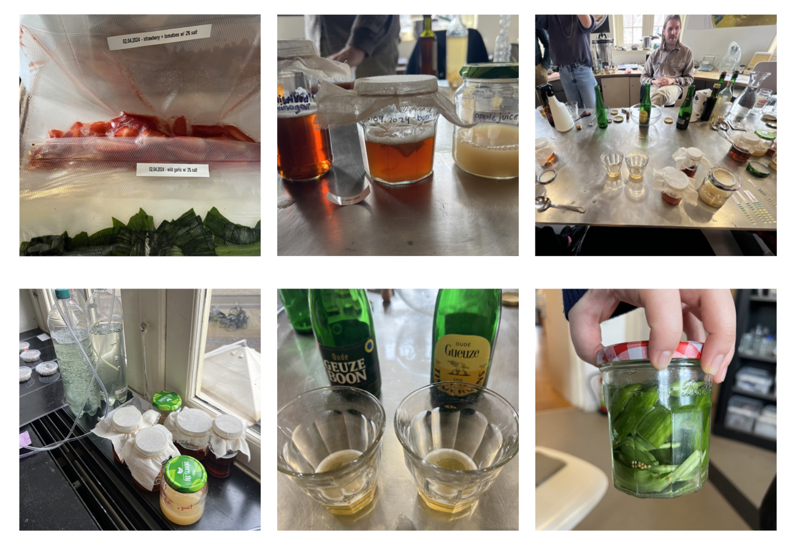
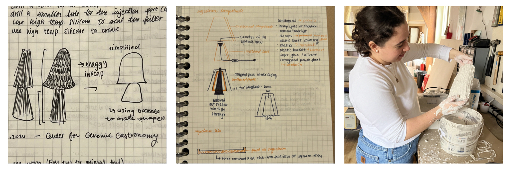
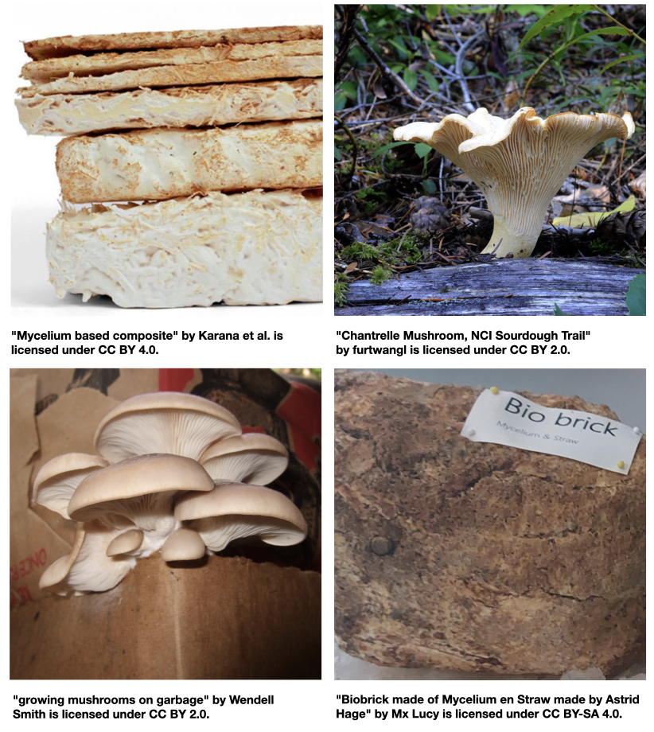
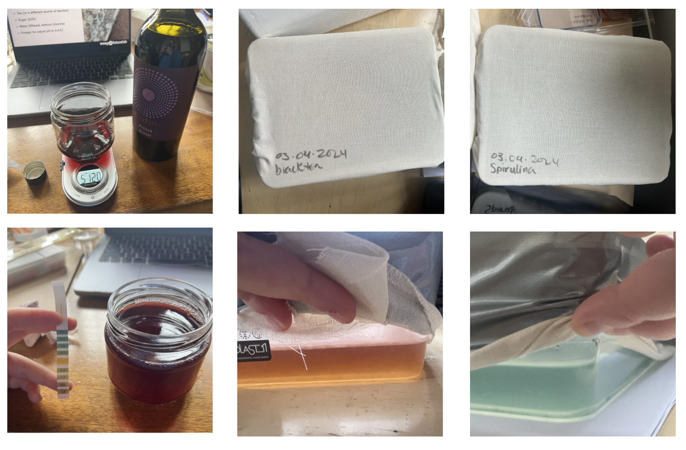
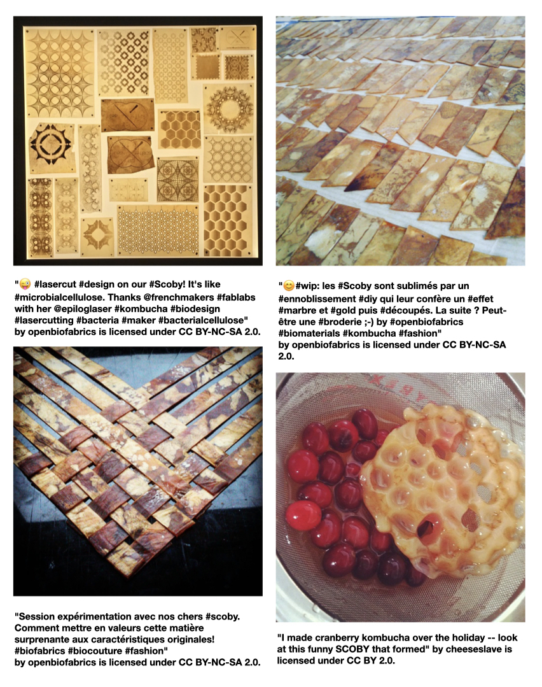
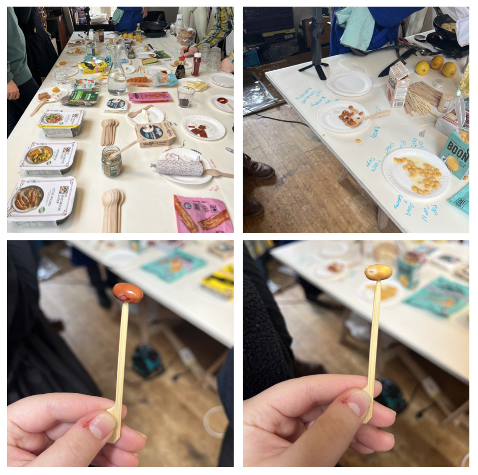

## Fermenting, growing biomaterials, and the futures of food 

**Tuesday - Fermenting with Margherita Soldati + Mads Sørensen** 

Margherita Soldati + Mads Sørensen's lecture on fermentation gave me insight into the different types that exist (Alcoholic + Lactic Acid Fermentations) as well as the different bodily fermentations. To learn that this way of processsing and perserving  foods was a way Margherita was able to consume was incredibly enlightening for me because . I became curious about what was going on in these containers that changed the propertieis of food from inedible and possibly dangerous to edible and safe. It was also refreshing to have Margherita and Mads share their different approaches to the process of fermenting. Margherita takes a more organised one, in the sense that measurements and alterations are well document to better understand the changes that will occur, while Mads takes on a more freeform approach most likely because of how intuitive it has become for him but because he's not changing the food to make consumptions for him possible but to simply consume. 

Top left - my lacto fermentation from that day which contained: wild garlic leaves and tomatoes/strawberries 

Top middle/right - the alcohol fermentations using beer, apple juice, yeast, and a vinegar mother.

Bottom left - the fermenting jars next to our bioreactor coexisting.

Bottom middle - lambic beer tasting, personally too funky for me but I really enjoyed Mads' homemade light beer.

Bottom right - my pickling jar containing cucumbers, wild garlic leaves, bay leaves, + mustard seeds.

**Wednesday - Mycelium + SCOBY** 

A quick lecture on mycelium, what it is/applications/species/how to grow. Afterwards we started to make our own containers of kombucha to grow SCOBY leather. I had done this before but never learned that tea could be subsituted for anything with tanins. I thought it would be quite fun to make a kombucha contianer with wine to see how it would stain the SCOBY.

**Thursday - Centre for Genomic Gastronomy with Zac Denfeld**

Zac Denfeld, one of the co-founders, focused his talk on "3 Cs" that he says they have been focusing on for the last 10+ years, complexities, controversies, and care. It was enlightening to be able to listen and see what Zac and Cat have been doing and the intentionality behind their projects and the communities they've fostered through them.

[link to Instagram ](https://www.instagram.com/carolina.minana/)