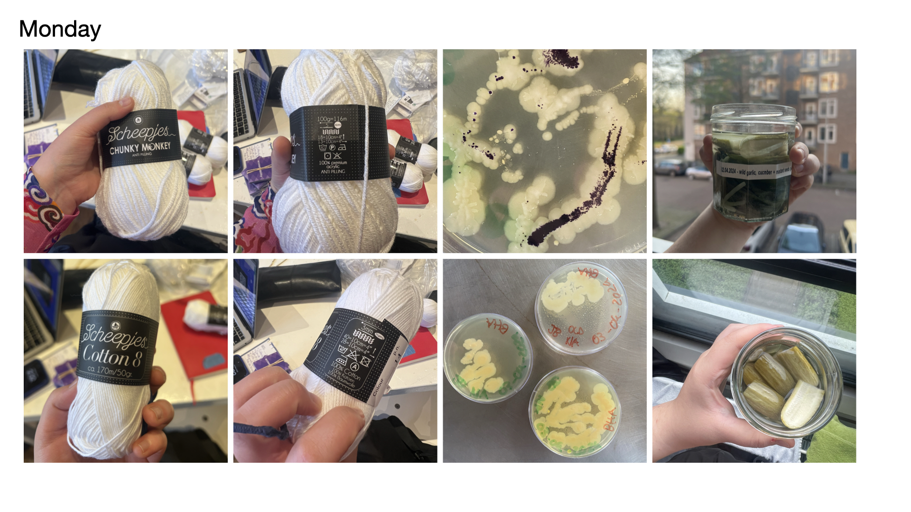
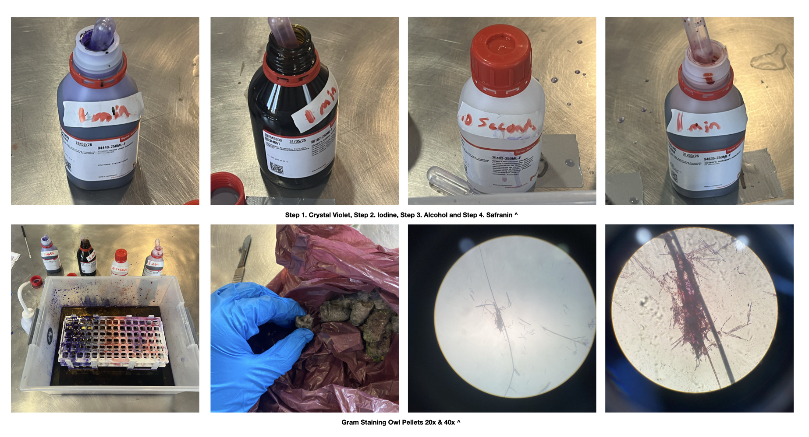
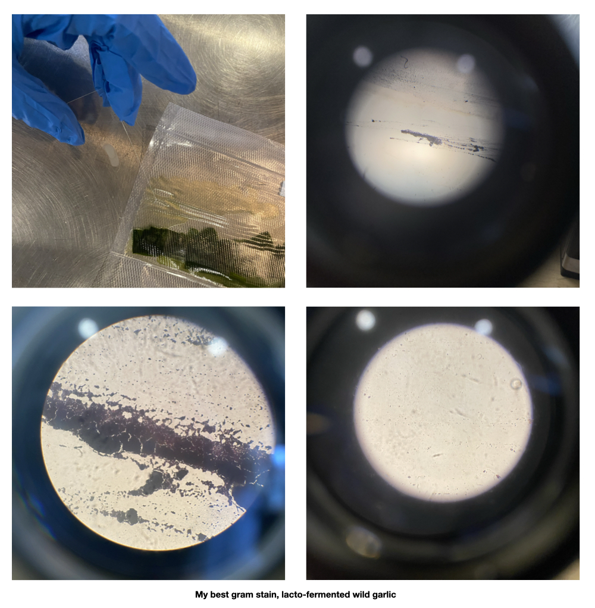
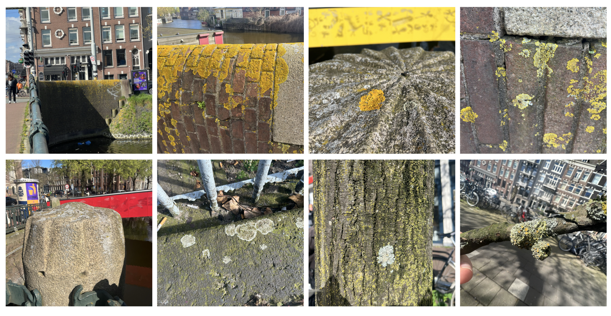
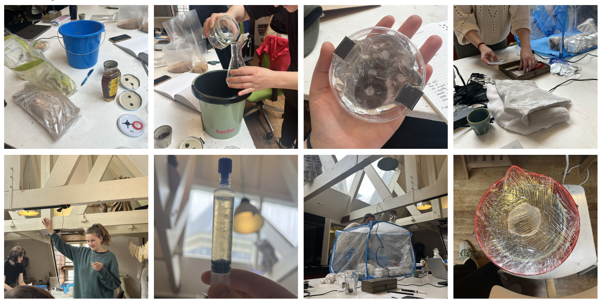

## Microorganisms + Mycelium

**Monday - Microbial Wonder with Maro Pebo + Bacterial Dyes**

Maro's lecture on 'Microbial Wonder' was very eye opening for me. I thoroughly enjoyed learning about how decentralising the human perspective, in this case my own, of a city to start considering and viewing cities from the persepctive of other organisms such as microorganisms like lichen. I used to have a tendency to view the organisms that I've worked with such as SCOBY and mold as my material, but after this lecture I noticed a shift of my perspective to start viewing them as collaborators and to learn how to work alongside them not for my own benefit but instead for it to be a symbiotic relationship. 

Afterwards, we conducted our own experiments of dying fabrics and yarns with Janthinobacterium, which presents itself as a dark purple. We did two tests with different mediums (LB and Standard Nutrient Agar) with slight drops of glycerine to enhance the growth of the bacteria, Within those tests we used synthetic and natural fabrics + yarns. I decided to use LB and yarn with the hope of creating a textile, however, after keeping the yarn in the incubator for three weeks, the growth was sparse and perhaps the balls of yarn were to tightly wrapped. We also later learned that the presence of glucose actually inhibits the growth of the janthinobacterium which was the reason the tests with standard nutrient agar didn't produce the purple colour. 

**Tuesday - Imagining Ecological Microbiomes with Justin Stewart**

This day we learned how to gram stain which is a way to visualise and see the bacteria, yeasts and other micobes within a sample and the way this is done is through the differentiation of the colours pink and purple. It was also very interesting to learn how Justin works within two contrasting views, they use gram staining as a method of imaging and visualising the underground relationships of root systems while also using global imaging through cameras in space as a tool for mapping (in their example they showed a map of fungal netweorks and biodiversity around the world).

Gram staining is a four step procedure:

1. Crystal Violet
- The primary stain added to specimen smear

2. Iodine
- Acts as mordant that makes dye less soluble so it adheres to the cell walls

3. Alcohol
- Decolorizer and washes away stain from gram (-) cell walls

4. Safranin
- Counter stain allows dye adherece to gram (-) cell walls 

Gram-negative present through the colour pink while Gram-positive presents through the colour purple. Stains can quantify the following: morphotype diversity, abundance, eveness and in some cases taxonomy. 

I found this workshop really fun and enjoyed the entire procedure, however, I did find difficulty trying to imagine how I could apply this to my own practice. 

**Wednesday - Looking for Lichen with Adriana Knouf**

Lichen is something I've always noticed but never truly know what it is or what I've been looking at, that was until Adriana Knouf's workshop on looking for lichen around Amsterdam. While lichen are extremely mysterious organisms it was so fascinating to learn about the lichen thallus of the specie Xanthoria parietina which is made up of five sections: the cortex, algal zone, medulla, lower cortex, and rhizines. While looking at the lichen thallus Adriana pointed out how lichen are actually a combination of algae and fungi, giving me a better understanding of the structure of the organism and how we define organisms to be classified or categorised into constraiging boxes.

We collected samples of lichen from around Amsterdam and Adriana showed us how the species Xanthoria parietina (yellow wall lichen) reproduces. Through the apotechium of the lichen, which are cup-shaped fruiting bodies, the X. parietina's spores are being released from these areas and find spores that they are compatible with in order to reproduce. We did our own test of this by transplanting an apothecia onto the lid of a petri dish, wherein the cup would be facing the potato dextrose medium, allowing for the spores to be transferred onto the medium. Initially, the growth that appeared on the medium resemebeled that of a pink slime mould, however just after twenty days, it started presenting itself as a bright fuchsia coloured growth. I have yet to identify what it is.

While brainstorming ideas for the final project I found myself gravitating towards epxloring waste material as new composite material. I thought about the rise in bio-material ceramics using eggshells and wanted to try this out using a different calcium base material. After asking fish mongers for mollusc shells they didn't have I fond myself at an upscale restuarant asking for their oyster shells which they would happily set aside for me to take. And that evening I happily went home with a garbage bag filled with 40+ oyster shells.

**Thursday - Growing Mycelium**

We began exploring the amazing world of fungi through mycelium and Anne's magical box of mushroom treasures. Cris filled jars with honey and water culture for the liquid mycelium medium to be inoculated into. I assisted with the dry inoculation which took place using grain 

[link to Instagram ](https://www.instagram.com/carolina.minana/)