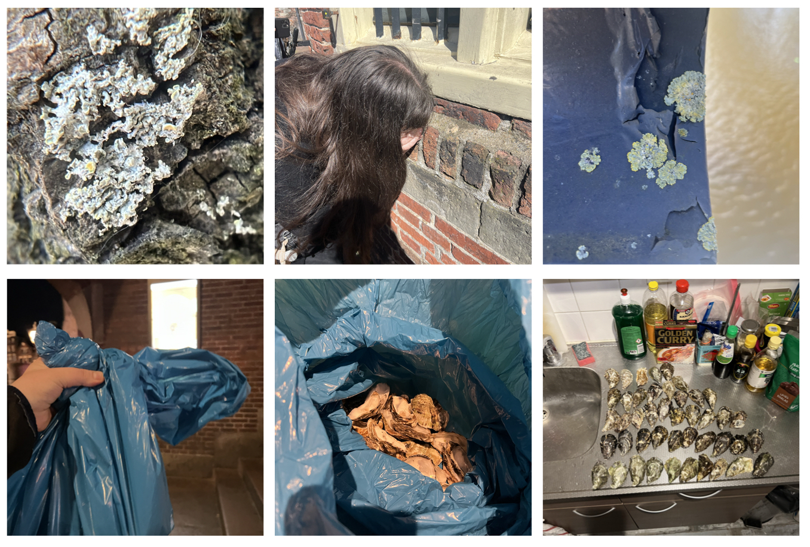

## Microorganisms + Mycelium

**Monday - Microbial Wonder with Maro Pebo + Bacterial Dyes**

Maro's lecture on 'Microbial Wonder' was very eye opening for me. I thoroughly enjoyed learning about how decentralising the human perspective, in this case my own, of a city to start considering and viewing cities from the persepctive of other organisms such as microorganisms like lichen. I used to have a tendency to view the organisms that I've worked with such as SCOBY and mold as my material, but after this lecture I noticed a shift of my perspective to start viewing them as collaborators and to learn how to work alongside them not for my own benefit but instead for it to be a symbiotic relationship. 

Afterwards, we conducted our own experiments of dying fabrics and yarns with Janthinobacterium, which presents itself as a dark purple. We did two tests with different mediums (LB and Standard Nutrient Agar) with slight drops of glycerine to enhance the growth of the bacteria, Within those tests we used synthetic and natural fabrics + yarns. I decided to use LB and yarn with the hope of creating a textile, however, after keeping the yarn in the incubator for three weeks, the growth was sparse and perhaps the balls of yarn were to tightly wrapped. We also later learned that the presence of glucose actually inhibits the growth of the janthinobacterium which was the reason the tests with standard nutrient agar didn't produce the purple colour. 

**Tuesday - Imagining Ecological Microbiomes with Justin Stewart**

This day we learned how to gram stain which is a way to visualise and see the bacteria, yeasts and other micobes within a sample and the way this is done is through the differentiation of the colours pink and purple. It was also very interesting to learn how Justin works within two contrasting views, they use gram staining as a method of imaging and visualising the underground relationships of root systems while also using global imaging through cameras in space as a tool for mapping (in their example they showed a map of fungal netweorks and biodiversity around the world).

Gram staining is a four step procedure:

1. Crystal Violet
- The primary stain added to specimen smear

2. Iodine
- Acts as mordant that makes dye less soluble so it adheres to the cell walls

3. Alcohol
- Decolorizer and washes away stain from gram (-) cell walls

4. Safranin
- Counter stain allows dye adherece to gram (-) cell walls 

Gram-negative present through the colour pink while Gram-positive presents through the colour purple. Stains can quantify the following: mophotype diversity, abundance, eveness and in some cases taxonomy. 

I found this workshop really fun and enjoyed the entire procedure, however, I did find difficulty trying to imagine how I could apply this to my own practice.

**Wednesday - Looking for Lichen with Adriana Knouf**

**Thursday - Growing Mycelium**

[link to Instagram ](https://www.instagram.com/carolina.minana/)