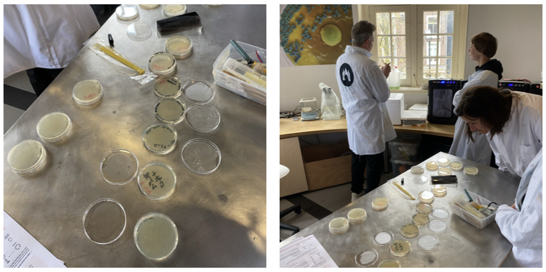
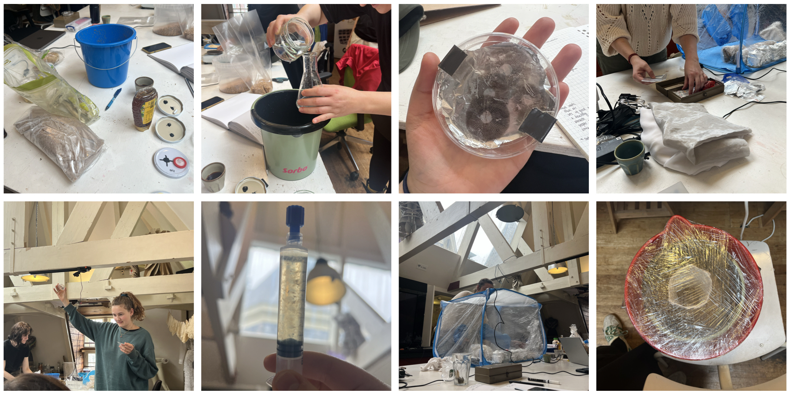
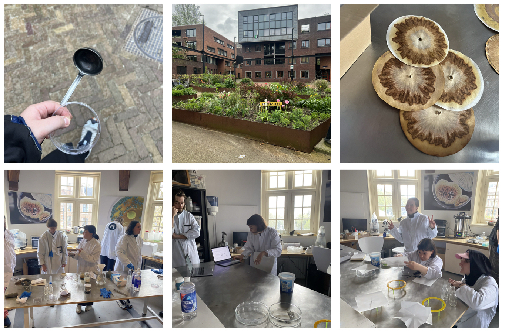
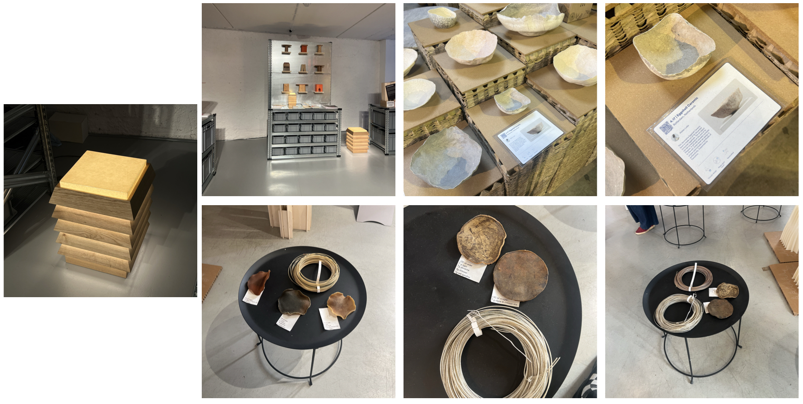

## Biosensors and Soil Chromatography

**Monday - E.coli biosensor with Tom Peeters + Matthijs de Block**

Outline:

1. What is a biosensor? 
2. How will we be using it today?
3. Protocol + procedure
4. Thoughts

We began this week learning from Tom, a biotechnology researcher focusing his research on yeasts, and Matthijs, a research-based artists who paricipate in past edition of BioHack. They have been collaborating for the last few years on projects that look at the intersection of yeasts and art. 

Tom began by introducing the concept of a biosensor and the

**Tuesday - Continuation of E.coli biosensor**
1. 
Due to an incompentance in the cells we used, the genetic modification of our E.coli didn't work. 

**Wednesday - Soil Chromatography**

Outline:
1. What is soil chromatography?
2. How and why is it used?
3. How can I apply this to my own practise?

Hannah introduced us to Pfeiffer’s circular chromatography, or more commonly know as soil chromatography which is the process that shows the chemical, physical and biological characterisitcs of organic matter. This cost-effective method of understanding soil composition has been used by farmers, providing them a visual representation of their soil's healthy and possible biological activity that might be taking place. 

**Thursday - Project Discussions + MDW Research**

Outline:

1. Discussions with Anne and Maarten
- Last week I felt strongly working with waste material, specifically ones with a presence of high calcium. I've been seeing a lot of eggshell based-composites across social media and at exhibitions that this inspired me to research what other raw materials have a high presence of calcium. I came across papers that focused on biomineralisation as an inspiration for design, focusing on human, social and environmental design.  

When speaking to Anne and Maarten about it today, they were encouraging of this idea of using the extracted powder from high calcium waste objects into 'bioceramics'. Inspired by the Philippines' use of oyster shells (from the placuna placenta mollusk) as a substitute for glass in windows, which is commonly known as Capiz windows, I wanted to explore how it would translate as a ceramic medium. 
2. ISO @ MDW
- Do designers show their process? How do designers show their process? How do the components they include contribute to my understanding of their piece/body of work?
- Material Research and Development

3. Takeaways from MDW
- 

[link to Instagram ](https://www.instagram.com/carolina.minana/)