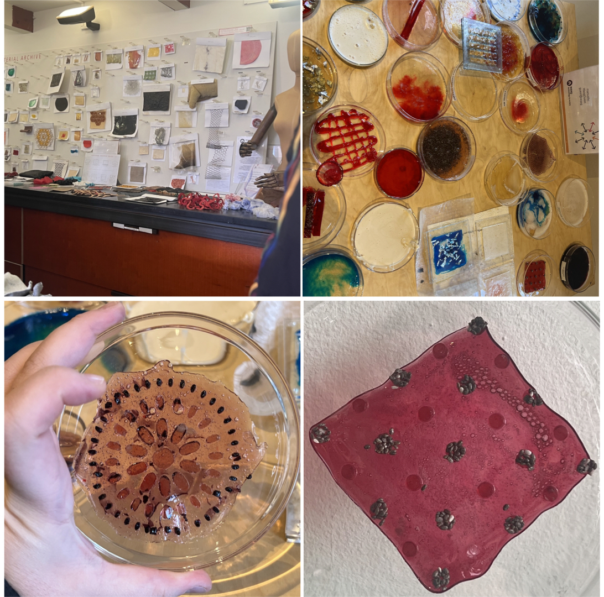
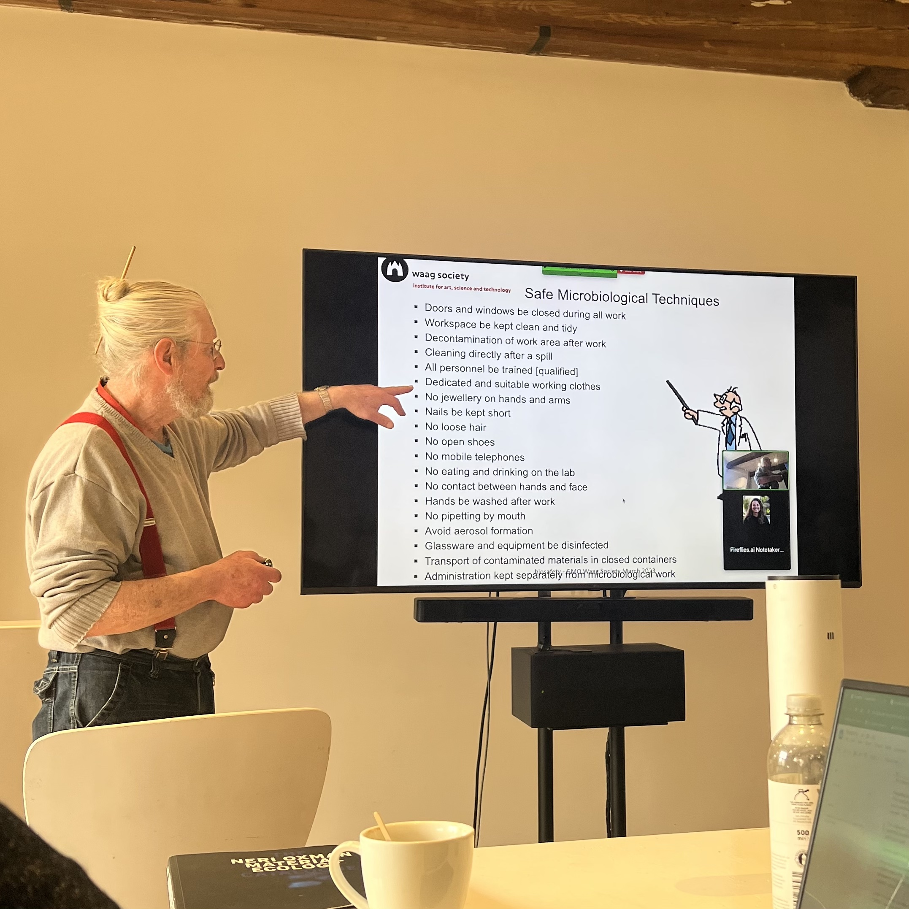
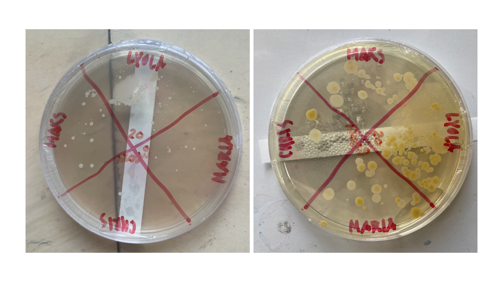

## Bioplastics, Biosafety + Documentation

**Monday** - Introduction lecture given by Lucas, a quick tour around Waag Futurelab (including the Textile Lab see top left square) and a short workshop on simple bioplastic production.

We were given the freedom to explore different bioplastics and our group created an assortment (see top right square). I particularly enjoyed experimenting with bioresin enjoyed using the acrylic stamps to manipulate their forms. I created a flower like swatch with purple and light red dyed resin (see bottom left square) and played around with a circle stamp and some chia seeds to create a polka dotted swatch (see bottom right square) to explore how I can apply the same recipe with different outcomes.

**Tuesday** - Biosafety lecture given by Per and presentations on backgrounds given by my peers and myself. No other images were taken as this days was really focused on establishing our understanding of the importance of biosafety. 

**Wednesday** - Documentation lecture and learning how to set up our own sites using GitHub and Sublime Text (which I am writing the contents of this site on) to make sure that the next installments of BHA and future participants have examples to use or gain inspiration from. No images from this day as it mainly consisted of troubleshooting the issues with my computer *(I still do not understand what was done but I am grateful for the assistance and patience from Maarten and Anne to get this site up and running)*.

**Thursday** - Continuation of documentation and checking on our bacteria exercise. 

For this exercise I decided to look at the phone screens of my peers to see who has the cleanest and who might have the dirtiest. I have quite an oily face, so after each phone call, I have to wipe my screen and the front facing camera as there is always residue left. With this in mind, I thought it would be interesting to see what is left behind beyond oil and conducted this experiment. 

Below are a side to side comparisson of the same plate, the image on the left was captured a day after collection while the image on the right is five days after collection. The plate was left in the incubator at 37º to mimic body temperature and to provide the bacteria the ideal growing conditions.

[link to Instagram ](https://www.instagram.com/carolina.minana/)
