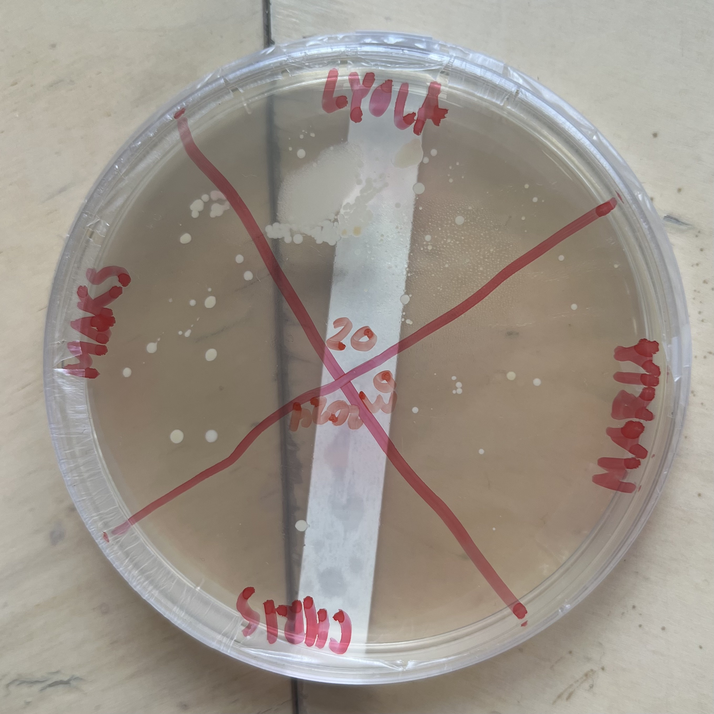
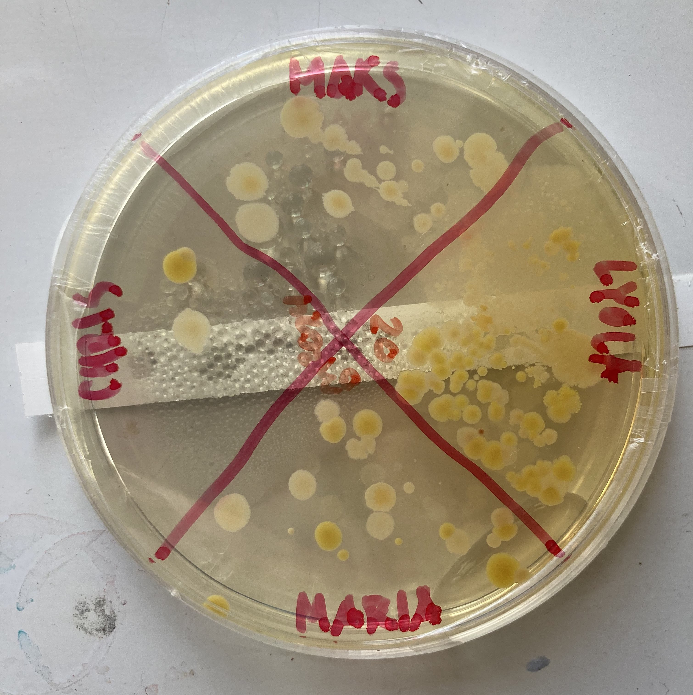

## Bioplastics, Biosafety + Documentation

Monday - Introduction lecture given by Lucas, a quick tour around and a short workshop on simple bioplastic production.

Tuesday - Biosafety lecture given by Per and presentations on backgrounds given by my peers and myself.

Wednesday - Documentation lecture and learning how to set up our own sites.

Thursday - Continuation of documentation and checking on our bacteria exercise. 

For this exercise I decided to look at the phone screens of my peers to see who has the cleanest and who might have the dirtiest. I have quite an oily face, so after each phone call, I have to wipe my screen and the front facing camera as there is always residue left. With this in mind, I thought it would be interesting to see what is left behind beyond oil and conducted this experiment. 

Below is the first place 

**bold**

[link to google](www.google.com)
